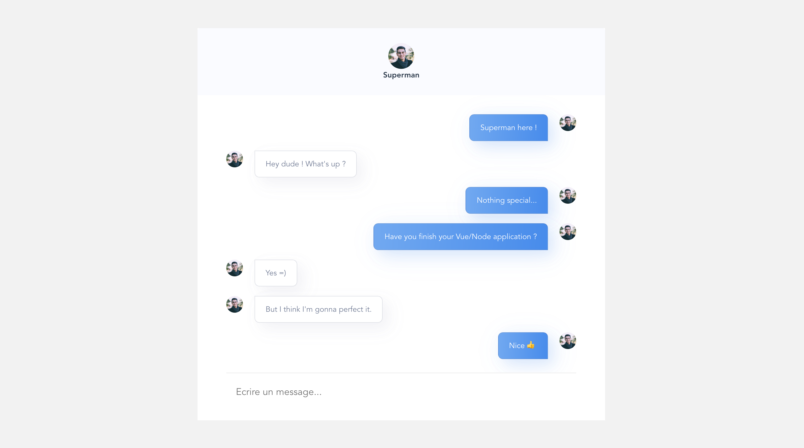

# inbenchat



## Before start

This is frontend part, find my backend in the following repository :
https://github.com/anthony-lopez-dev/inbenchat-socket

## Project setup

```
yarn install
```

### Compiles and hot-reloads for development
```
yarn serve
```

### Compiles and minifies for production
```
yarn build
```

### Lints and fixes files
```
yarn lint
```

### Customize configuration
See [Configuration Reference](https://cli.vuejs.org/config/).
